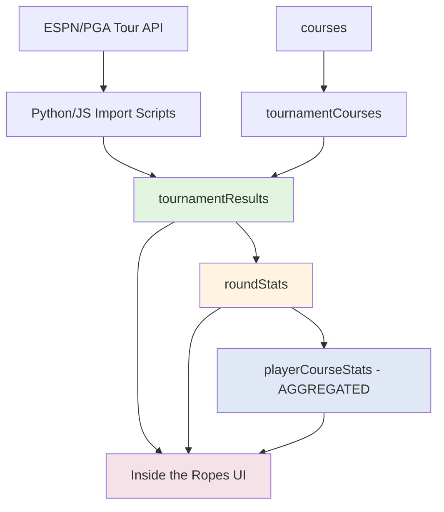
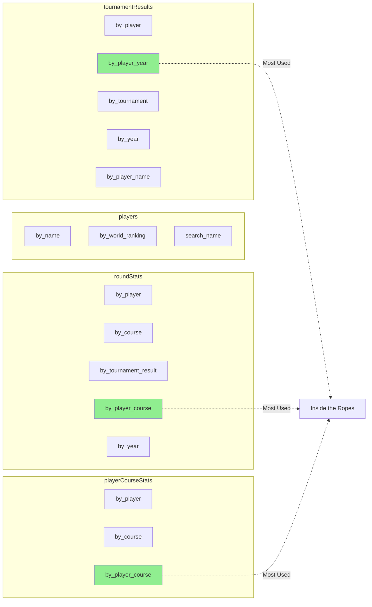
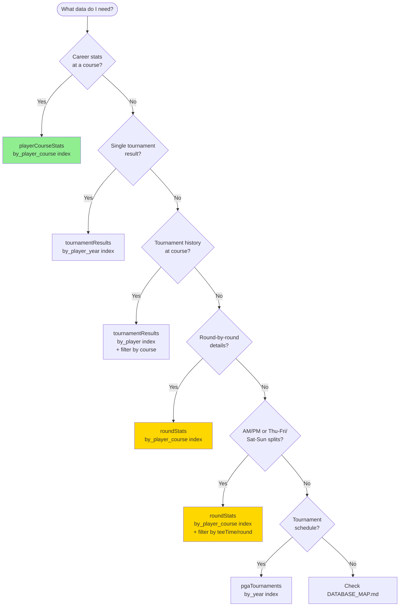
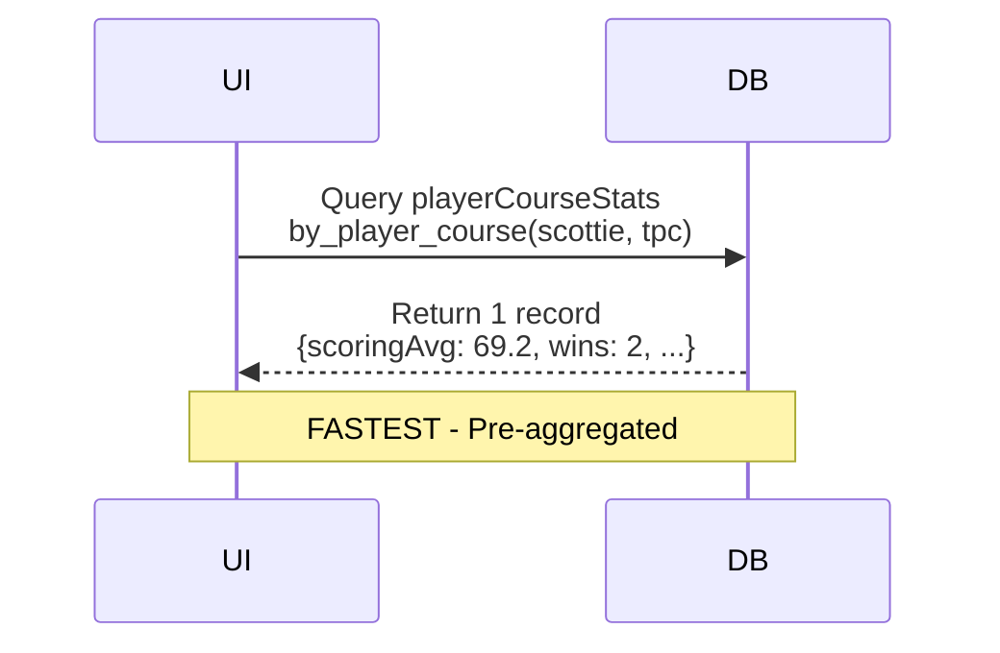
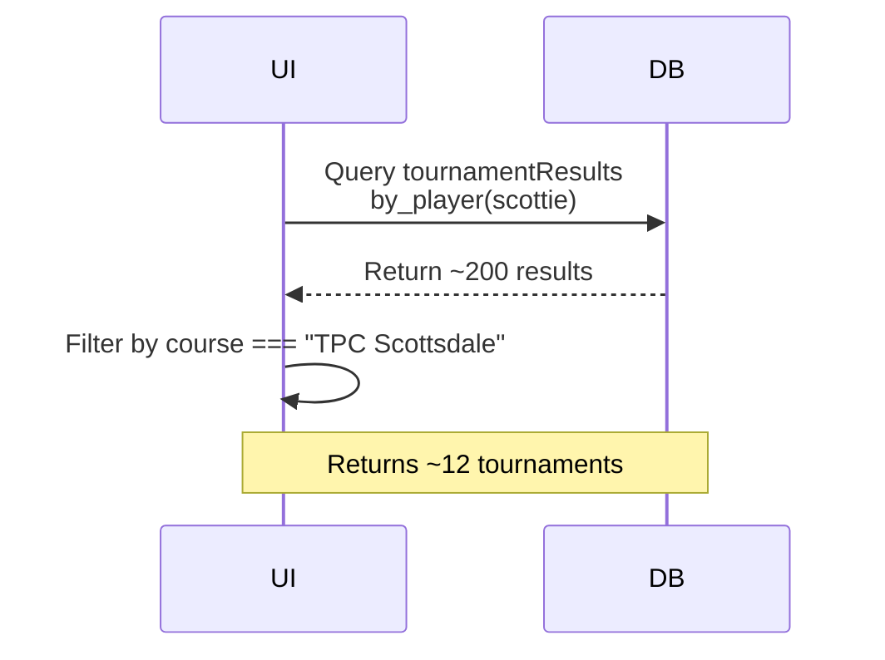
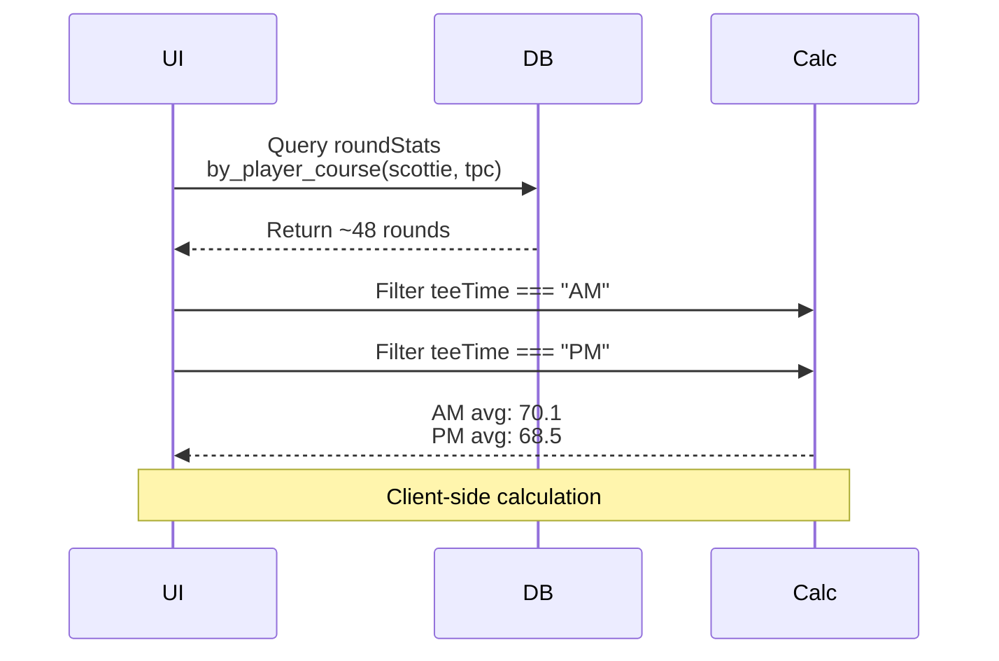
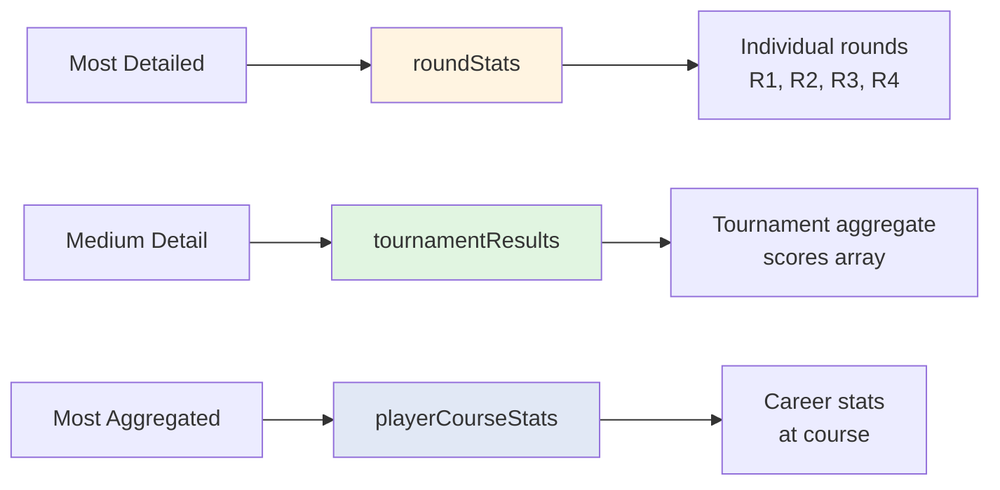

# GolfGod Database Schema Diagram

Visual representation of the GolfGod database schema and relationships.

---

## Entity Relationship Diagram

```mermaid
erDiagram
    players ||--o{ tournamentResults : "has results"
    players ||--o{ roundStats : "has rounds"
    players ||--o{ playerCourseStats : "has stats"
    players ||--o{ userFollows : "followed by"

    courses ||--o{ tournamentCourses : "hosts"
    courses ||--o{ tournamentResults : "results at"
    courses ||--o{ roundStats : "rounds at"
    courses ||--o{ playerCourseStats : "stats for"

    tournamentResults ||--o{ roundStats : "contains"

    users ||--o{ userFollows : "follows"

    players {
        id _id PK
        string name "Scottie Scheffler"
        string firstName "Scottie"
        string lastName "Scheffler"
        string country "United States"
        string countryCode "US"
        string birthDate "1996-06-21"
        string birthPlace "Ridgewood, New Jersey"
        string college "University of Texas"
        string swing "Right"
        number turnedPro 2018
        string height "6-3"
        string weight "205"
        string photoUrl
        number worldRanking 1
        number tourRanking 1
        string espnId "10547"
    }

    courses {
        id _id PK
        string name "TPC Scottsdale"
        string location "Scottsdale, Arizona"
        number par 71
        number yardage 7261
        number established 1986
        string designer "Tom Weiskopf"
        string type "Desert"
        string grassType "Bermuda"
        number stimpmeter
    }

    tournamentResults {
        id _id PK
        id playerId FK "→ players"
        string playerName "Denormalized for performance"
        number year 2024
        string date "Jan 4 - 7"
        string tournament "WM Phoenix Open"
        string course "TPC Scottsdale"
        string position "T1"
        array scores "69,72,68,70"
        number totalScore 279
        number toPar -9
        string score "-9"
        string overall "279"
        number earnings 1512000
    }

    roundStats {
        id _id PK
        id playerId FK "→ players"
        id courseId FK "→ courses"
        id tournamentResultId FK "→ tournamentResults"
        number year 2024
        number round 1
        number score 69
        number toPar -2
        string teeTime "AM or PM"
        number fairwaysHit 10
        number fairwaysPossible 14
        number greensHit 14
        number greensPossible 18
        number putts 28
        string scrambling "3/5"
        string sandSaves "2/3"
        number birdies 4
        number pars 13
        number bogeys 1
        number doubleBogeys 0
        number eagles 0
        number sgTotal 2.5
        number sgOtt 0.8
        number sgApp 1.2
        number sgArg 0.3
        number sgPutt 0.2
        number windSpeed 12
        number temperature 72
        string conditions "Sunny"
    }

    playerCourseStats {
        id _id PK
        id playerId FK "→ players"
        id courseId FK "→ courses"
        number roundsPlayed 42
        number scoringAverage 69.2
        number bestScore 63
        number worstScore 76
        number cutsPlayed 12
        number cutsMade 11
        number wins 2
        number top10s 7
        number top25s 10
        number totalEarnings 3024000
        number avgR1Score 70.1
        number avgR2Score 69.8
        number avgR3Score 68.9
        number avgR4Score 68.0
        number avgEarlyScore 69.95
        number avgWeekendScore 68.45
        number avgDrivingDistance 310.5
        number avgDrivingAccuracy 0.65
        number avgGIR 0.72
        number avgPuttsPerRound 28.5
        number avgScrambling 0.61
        number avgSandSaves 0.55
        number avgSgTotal 2.1
        number avgSgOtt 0.7
        number avgSgApp 0.9
        number avgSgArg 0.3
        number avgSgPutt 0.2
        number lastUpdated 1704672000000
        number lastTournamentYear 2024
    }

    tournamentCourses {
        id _id PK
        string tournamentName "WM Phoenix Open"
        id courseId FK "→ courses"
        number yearStart 1987
        number yearEnd "null = current"
        boolean isPrimary true
    }

    userFollows {
        id _id PK
        string userId FK "→ users (auth)"
        id playerId FK "→ players"
        number followedAt 1704672000000
    }

    pgaTournaments {
        id _id PK
        string tournament_id "2024_wm_phoenix_open"
        string name "WM Phoenix Open"
        number year 2024
        string dates_raw "Feb 1 - 4, 2024"
        string start_date "Feb 1"
        string end_date "Feb 4"
        string winner_name "Scottie Scheffler"
        number winner_espn_id 10547
        string winner_profile_url
        string winning_score "263 (-21)"
        number prize_money 9300000
        string status "completed or scheduled"
        string espn_tournament_id
        string espn_leaderboard_url
        string scraped_at "2024-01-15T12:00:00Z"
        string previous_winner_name "For scheduled tournaments"
        number previous_winner_espn_id
        string previous_winner_profile_url
    }
```

---

## Data Flow Diagram



**Legend**:
- 🟢 **Green** = Raw tournament data (aggregate scores)
- 🟡 **Yellow** = Detailed round data (individual rounds)
- 🔵 **Blue** = Aggregated career stats
- 🔴 **Pink** = UI/Application layer

---

## Index Reference Diagram



**Highlighted** = Most frequently used indexes for Inside the Ropes feature

---

## Query Decision Tree



---

## Relationship Cardinality

| From Table | To Table | Relationship | Example |
|------------|----------|--------------|---------|
| `players` | `tournamentResults` | **1:Many** | Scottie → 200+ tournaments |
| `players` | `roundStats` | **1:Many** | Scottie → 800+ rounds |
| `players` | `playerCourseStats` | **1:Many** | Scottie → 54 courses |
| `courses` | `playerCourseStats` | **1:Many** | TPC Scottsdale → 200 players |
| `courses` | `tournamentCourses` | **1:Many** | TPC Scottsdale → 1 tournament |
| `tournamentResults` | `roundStats` | **1:4** | 1 tournament → 4 rounds (usually) |

---

## Common Query Patterns

### Pattern 1: Inside the Ropes - Career Stats


### Pattern 2: Inside the Ropes - Tournament History


### Pattern 3: Split Stats - AM vs PM


---

## Data Granularity Levels



---

## Viewing This Diagram

**In VS Code**:
1. Install "Markdown Preview Enhanced" extension
2. Open this file
3. Press `Ctrl+Shift+V` (Windows/Linux) or `Cmd+Shift+V` (Mac)
4. Mermaid diagrams will render automatically

**In GitHub**:
- Mermaid diagrams render natively in GitHub markdown

**Online Viewer**:
- Copy Mermaid code to https://mermaid.live/

---

## Schema Updates

When you modify the schema:
1. ✅ Update `convex/schema.ts`
2. ✅ Update this diagram (`docs/SCHEMA_DIAGRAM.md`)
3. ✅ Update `DATABASE_MAP.md` with new relationships
4. ✅ Commit both files together

---

**Last Updated**: January 2025
**Schema Version**: 1.0
**Diagram Type**: Mermaid ERD
